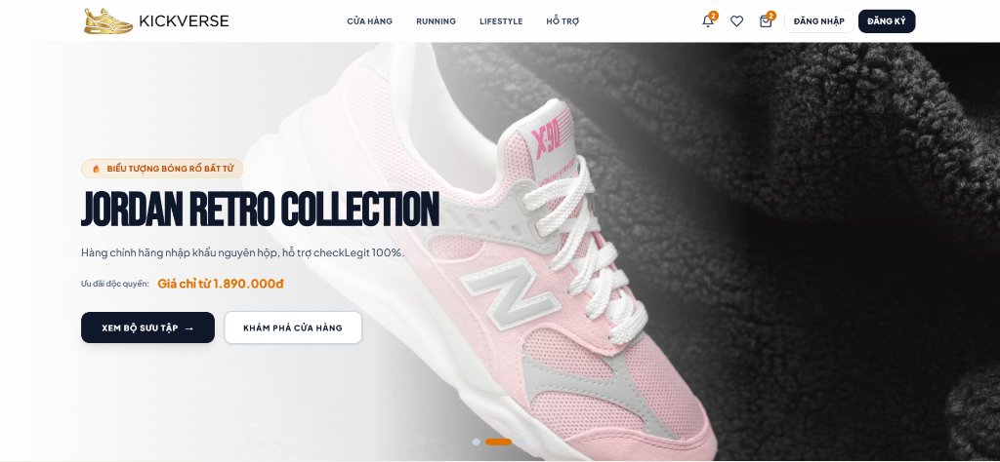
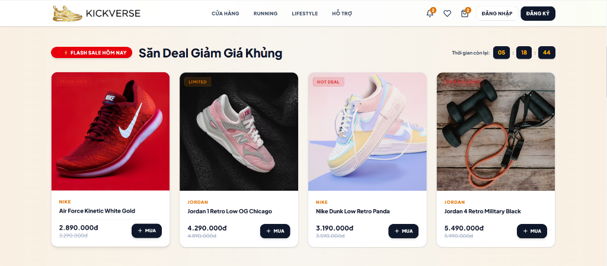
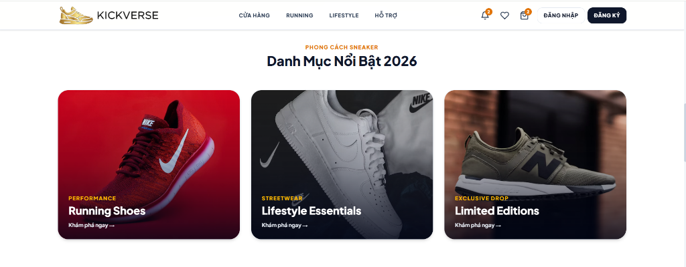
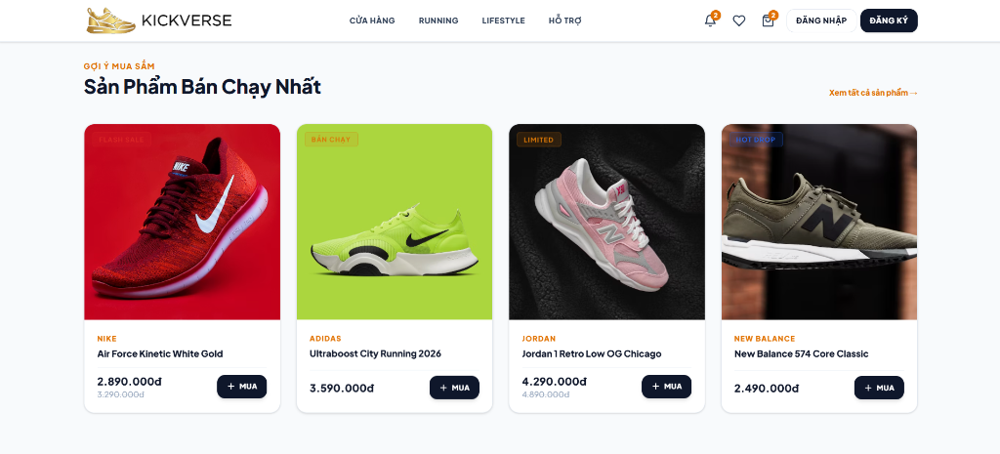

# 👟 KickVerse — Premium Sneaker & Streetwear E-Commerce Platform



**KickVerse** là nền tảng thương mại điện tử chuyên nghiệp, sang trọng hàng đầu dành cho các tín đồ Sneaker chính hãng và thời trang Streetwear. Hệ thống được kiến trúc hóa tách biệt hoàn toàn giữa **Frontend Single Page Application (SPA)** mượt mà và **Backend RESTful API High Performance**.

---

## 🖼️ Hình Ảnh Giao Diện Thực Tế (Showcase Screenshots)

### 1. Trang Chủ Hero Slider & Navigation Topbar


### 2. Sự Kiện Flash Sale Đếm Ngược & Deal Giảm Giá Khủng


### 3. Danh Mục Nổi Bật 2026 (Running Shoes, Lifestyle Essentials, Limited Editions)


### 4. Gợi Ý Mua Sắm & Sản Phẩm Bán Chạy Nhất


---

## ✨ Điểm Nổi Bật Về Thiết Kế & Giao Diện (Design System)

- **🎨 Tone Màu Sang Trọng Pure White Light Luxury (`#FFFFFF`)**:
  - Toàn bộ giao diện từ **Trang Khách hàng (Client Portal)**, **Trang Quản trị (Admin Portal)**, **Trang Cá Nhân (Customer Account)** cho tới **Trạm Bán Hàng Tại Quầy (Staff POS Workstation)** đều phủ màu trắng sáng tinh tế (`#f8fafc` canvas, `#ffffff` card container), tiêu đề đen Slate 900 sắc nét và điểm nhấn ánh kim Vàng Amber 600 (`#d97706`).
- **📱 Tối Ưu Hóa Giao Diện Mobile First (100% Responsive)**:
  - Danh mục sản phẩm trên thiết bị di động hiển thị **1 sản phẩm / hàng (`grid-cols-1`)** giúp trải nghiệm nhìn hình ảnh siêu to, sắc nét và thao tác mua sắm dễ dàng.
- **⚡ Hệ Thống Component Custom Độc Quyền**:
  - Nút chọn Dropdown tùy chỉnh `KvSelect.vue` bo góc tròn 16px (`rounded-2xl`), hiệu ứng đổ bóng mượt và **ẩn thanh cuộn xấu (`.no-scrollbar`)**.
  - Khung giỏ hàng xem nhanh (Cart Drawer) & Khung thông báo trượt bên phải (Slide-Over Notification Panel) với khóa cuộn trang tự động.

---

## 🚀 Các Chức Năng Chính Toàn Hệ Thống

### 1. 🛍️ Phân Hệ Khách Hàng (Customer Portal)
- **Trang Chủ & Banner Carousel (`/`)**: Slider hình ảnh HD giới thiệu bộ sưu tập Hot Drop, các mục Flash Sale giảm giá đếm ngược, Danh mục nổi bật và Sản phẩm bán chạy.
- **Cửa Hàng & Lọc Sản Phẩm (`/shop`)**: Tìm kiếm theo từ khóa, lọc theo Thương hiệu (Nike, Adidas, Jordan, New Balance...), Danh mục (Running, Lifestyle), mức giá và sắp xếp theo giá tăng/giảm.
- **Chi Tiết Sản Phẩm (`/shop/:slug`)**: Chọn Size EU (38, 39, 40, 41, 42...), xem ảnh biến thể màu sắc, kiểm tra trạng thái tồn kho thực tế, thêm vào giỏ hàng hoặc danh sách yêu thích (Wishlist).
- **Trang Hỗ Trợ Đa Năng (`/support`)**: Trung tâm hỗ trợ khách hàng gồm 4 tab chuyên sâu (*Cách Đặt Hàng, Bảng Chọn Size Giày Chuẩn, Chính Sách Đổi Trả 14 Ngày, Tư Vấn Khách Hàng 24/7*).
- **Hệ Thống Tài Khoản Cá Nhân (`/account`)**:
  - **Hồ sơ cá nhân (`/account/profile`)**: Cập nhật thông tin thành viên, ảnh đại diện, đổi mật khẩu bảo mật và bật/tắt thông báo.
  - **Lịch sử đơn hàng (`/account/orders`)**: Xem danh sách đơn hàng, xem tiến trình vận chuyển GHN/GHTK, và **gửi yêu cầu Đổi / Trả hàng trực tiếp**.
  - **Sổ địa chỉ (`/account/addresses`)**: Quản lý nhiều địa chỉ giao hàng, đặt địa chỉ mặc định.
  - **Ví Voucher & Điểm thưởng (`/account/vouchers`)**: Theo dõi điểm tích lũy thành viên VIP và lưu trữ các mã giảm giá toàn sàn.
  - **Thông báo (`/notifications`)**: Xem danh sách tin tức khuyến mãi và tiến trình giao đơn.

### 2. 👑 Phân Hệ Quản Trị Hệ Thống (Admin Portal - `/admin`)
- **Dashboard Thống Kê (`/admin`)**: Biểu đồ doanh thu, tổng số đơn hàng, khách hàng mới và cảnh báo sản phẩm sắp hết hàng.
- **Quản Lý Sản Phẩm & Biến Thể Matrix (`/admin/products`)**: Tạo/Sửa sản phẩm, cấu hình mã SKU từng biến thể Size/Màu, giá nhập và giá bán niêm yết.
- **Quản Lý Nhập Kho Tồn Kho (`/admin/inventory`)**: Lập phiếu nhập kho bổ sung số lượng cho từng mã SKU.
- **Quản Lý Đơn Hàng & In Hóa Đơn (`/admin/orders`)**: Phê duyệt trạng thái đơn, xem chi tiết và in phiếu hóa đơn thanh toán chuẩn thermal.
- **Quản Lý Yêu Cầu Đổi / Trả Hàng (`/admin/returns`)**: Xử lý duyệt hoặc từ chối các phiếu yêu cầu đổi size hoặc hoàn tiền từ khách hàng.
- **Ma Trận Phân Quyền Nhân Viên RBAC (`/admin/users`)**: Phân quyền chi tiết cho nhân viên theo từng mô-đun chức năng.
- **Chương Trình Khuyến Mãi (`/admin/coupons` & `/admin/flash-sale`)**: Cấu hình mã voucher giảm giá toàn sàn và các đợt Flash Sale đếm ngược.
- **Cấu Hình Tích Hợp Hệ Thống (`/admin/settings`)**: Kết nối API Giao Hàng Nhanh (GHN), GHTK, Cổng thanh toán VNPAY & VietQR Napas247.

### 3. 🏪 Phân Hệ Nhân Viên Bán Hàng & CSKH (Staff Portal - `/staff`)
- **Trạm Bán Hàng Tại Quầy POS (`/staff/pos`)**: Giao diện tạo đơn hàng nhanh cho khách mua trực tiếp tại showroom, quét mã barcode và in hóa đơn khổ 80mm.
- **Trung Tâm Hỗ Trợ CSKH (`/staff/support`)**: Khung chat tư vấn trực tuyến 3 cột cho nhân viên tiếp nhận thắc mắc của khách hàng.

---

## 🛠️ Công Nghệ Sử Dụng (Tech Stack)

### Frontend (`kick-fe`)
- **Framework:** Vue 3 (Composition API & `<script setup>`)
- **Build Tool:** Vite (Tốc độ biên dịch cực nhanh)
- **State Management:** Pinia (Store quản lý Cart, Wishlist, Notification, Auth)
- **Routing:** Vue Router (Lazy loading routes)
- **Styling:** Tailwind CSS 4 (Custom design tokens & `@utility no-scrollbar`)

### Backend (`kick-api`)
- **Core:** Java 17, Spring Boot 3 (Spring Web, Spring Security, Spring Data JPA)
- **Database Migration:** Flyway (Phiên bản V1 đến V11)
- **Database:** PostgreSQL (Môi trường phát triển & sản xuất qua Docker Compose)
- **Build Tool:** Maven

---

## 🗄️ Cấu Trúc Cơ Sở Dữ Liệu Flyway Migrations (V1 -> V11)

| Tệp Migration | Chức Năng Bảng Cơ Sở Dữ Liệu |
| :--- | :--- |
| `V1__init_users_roles.sql` | Khởi tạo bảng `users`, `roles`, `user_roles` (Tài khoản & Vai trò) |
| `V2__init_addresses.sql` | Khởi tạo bảng `addresses` (Sổ địa chỉ nhận hàng) |
| `V3__init_catalog.sql` | Khởi tạo bảng `brands`, `categories`, `products`, `product_variants`, `product_images` |
| `V4__init_cart.sql` | Khởi tạo bảng `carts`, `cart_items` (Giỏ hàng trực tuyến) |
| `V5__init_coupons.sql` | Khởi tạo bảng `coupons`, `coupon_usages` (Mã giảm giá) |
| `V6__init_orders_payments.sql` | Khởi tạo bảng `orders`, `order_items`, `payments` (Đơn hàng & Thanh toán) |
| `V7__init_refunds_stock.sql` | Khởi tạo bảng `refunds`, `stock_transactions` |
| `V8__init_reviews_wishlist.sql` | Khởi tạo bảng `reviews`, `review_images`, `wishlists` (Đánh giá & Yêu thích) |
| `V9__init_chat_notifications.sql` | Khởi tạo bảng `notifications`, `conversations`, `messages`, `message_attachments` |
| `V10__add_refresh_token_to_users.sql` | Bổ sung các trường `refresh_token` & `refresh_token_expiry` cho bảng `users` |
| `V11__add_loyalty_banners_flash_sale_returns.sql` | Bổ sung trường `tier`, `points`, `total_spent` cho `users`, bảng `banners`, `flash_sale_campaigns`, `flash_sale_items`, `stock_import_receipts` & `return_requests` |

---

## 💻 Hướng Dẫn Khởi Chạy (Local Setup)

### Yêu Cầu Cần Có
- **Java JDK 17** trở lên
- **Node.js 18+** & npm
- **Docker** & Docker Desktop

### 1. Khởi Chạy Cơ Sở Dữ Liệu & Backend (`kick-api`)
```bash
# 1. Truy cập thư mục backend
cd kick-api

# 2. Khởi động PostgreSQL Database qua Docker
docker compose up -d

# 3. Chạy ứng dụng Spring Boot Backend
# Trên Windows:
.\mvnw.cmd spring-boot:run

# Trên macOS / Linux:
./mvnw spring-boot:run
```

### 2. Khởi Chạy Giao Diện Frontend (`kick-fe`)
```bash
# 1. Truy cập thư mục frontend
cd kick-fe

# 2. Cài đặt các thư viện phụ thuộc
npm install

# 3. Chạy ứng dụng Vue 3 Vite ở môi trường dev
npm run dev
```

 TRUY CẬP ỨNG DỤNG TẠI: **[http://localhost:5173](http://localhost:5173)**