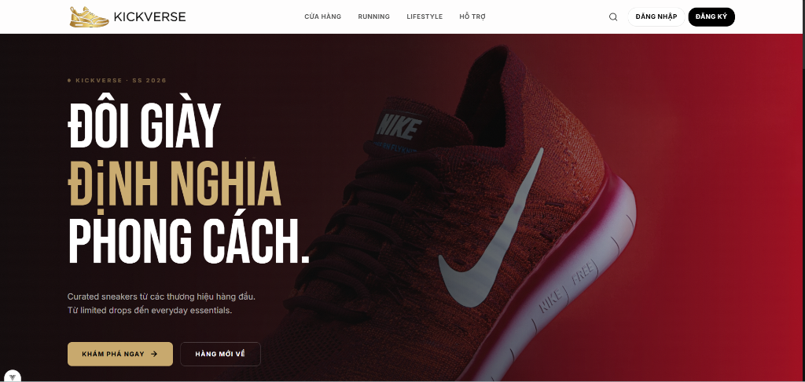

# KickVerse



KickVerse là dự án website thương mại điện tử chuyên cung cấp giày sneaker và thời trang streetwear. Dự án được phát triển theo mô hình tách biệt Frontend (Single Page Application) và Backend (RESTful API).

---

## Công nghệ sử dụng

### Frontend (`kick-fe`)
- **Core:** Vue 3 (Composition API), Vite, Vue Router
- **State Management:** Pinia
- **Styling:** Tailwind CSS (Custom theme với giao diện Dark Mode)

### Backend (`kick-api`)
- **Core:** Java 17, Spring Boot 3
- **Data Access:** Spring Data JPA, Hibernate
- **Database:** PostgreSQL (chạy môi trường local qua Docker Compose)

---

## Các tính năng chính

### Phân hệ Khách hàng (Client Portal)
- **Duyệt & Tìm kiếm:** Xem danh sách sản phẩm, lọc theo danh mục (Running, Lifestyle).
- **Chi tiết sản phẩm:** Xem thông tin chi tiết, chọn size, thêm vào giỏ hàng hoặc danh sách yêu thích (Wishlist).
- **Giỏ hàng & Đặt hàng:** Quản lý giỏ hàng và tiến hành đặt hàng (Checkout).
- **Hệ thống tài khoản:** Đăng ký, đăng nhập (có tích hợp sẵn các tài khoản demo nhanh cho Client, Staff và Admin).

### Phân hệ Quản trị (Admin & Staff Portal)
- **Admin Dashboard:** Thống kê doanh thu, quản lý danh sách sản phẩm, đơn hàng và tài khoản người dùng.
- **Staff Dashboard:** Tiếp nhận và xử lý trạng thái đơn hàng.

---

## Hướng dẫn cài đặt & Khởi chạy (Local Setup)

### Yêu cầu hệ thống
- Java JDK 17 trở lên
- Node.js 18+ & npm
- Docker & Docker Compose

### 1. Khởi chạy Database & Backend
1. Truy cập thư mục backend:
   ```bash
   cd kick-api
   ```
2. Khởi động PostgreSQL qua Docker Compose:
   ```bash
   docker compose up -d
   ```
3. Chạy ứng dụng Spring Boot:
   - Trên Windows:
     ```powershell
     .\mvnw.cmd spring-boot:run
     ```
   - Trên macOS/Linux:
     ```bash
     ./mvnw spring-boot:run
     ```

### 2. Khởi chạy Frontend
1. Truy cập thư mục frontend:
   ```bash
   cd kick-fe
   ```
2. Cài đặt các thư viện phụ thuộc:
   ```bash
   npm install
   ```
3. Chạy dự án ở môi trường phát triển:
   ```bash
   npm run dev
   ```
4. Mở trình duyệt và truy cập: [http://localhost:5173](http://localhost:5173)