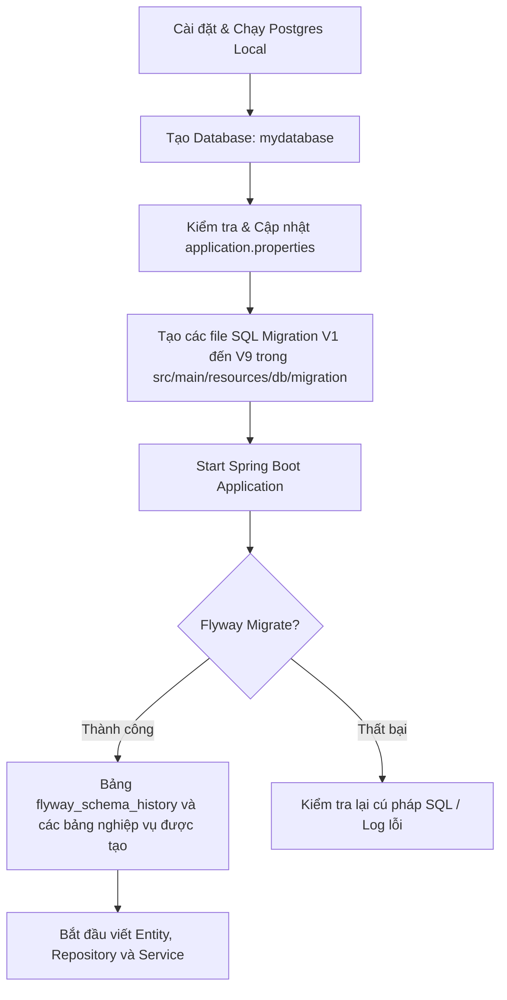

# Hướng dẫn làm việc với Database (Flyway & PostgreSQL) - KickVerse

Tài liệu này hướng dẫn cách cấu hình, thiết kế và phát triển Database cho dự án **KickVerse (kick-api)** sử dụng **Spring Boot 3 + Spring Data JPA + PostgreSQL** và **Flyway** để quản lý DB migration.

---

## 1. Cấu hình ban đầu (Configuration)

### 1.1. Thêm Dependency vào `pom.xml`
Để tích hợp Flyway vào Spring Boot và làm việc với PostgreSQL, hãy bổ sung các dependency sau vào file [pom.xml](file:///d:/Workspaces/PET/KickStore/kick-api/pom.xml):

```xml
<!-- Flyway Core -->
<dependency>
    <groupId>org.flywaydb</groupId>
    <artifactId>flyway-core</artifactId>
</dependency>
<!-- Hỗ trợ PostgreSQL cho Flyway -->
<dependency>
    <groupId>org.flywaydb</groupId>
    <artifactId>flyway-database-postgresql</artifactId>
</dependency>
```

### 1.2. Cấu hình `application.properties`
Chỉnh sửa cấu hình trong file [application.properties](file:///d:/Workspaces/PET/KickStore/kick-api/src/main/resources/application.properties) như sau để bật Flyway và đồng bộ hóa với JPA:

```properties
spring.application.name=kickverse

# ==========================================
# 1. CẤU HÌNH DOCKER COMPOSE
# ==========================================
# Tắt tính năng tự động chạy Docker Compose của Spring Boot (để dùng DB local)
spring.docker.compose.enabled=false

# ==========================================
# 2. CẤU HÌNH KẾT NỐI DATABASE LOCAL
# ==========================================
spring.datasource.url=jdbc:postgresql://localhost:5432/mydatabase
spring.datasource.username=postgre
spring.datasource.password=admin
spring.datasource.driver-class-name=org.postgresql.Driver

# ==========================================
# 3. CẤU HÌNH FLYWAY MIGRATION
# ==========================================
spring.flyway.enabled=true
spring.flyway.locations=classpath:db/migration
# Tự động tạo bảng lịch sử flyway_schema_history nếu DB đã có dữ liệu trước đó
spring.flyway.baseline-on-migrate=true
# Không cho phép chạy các file migration cũ hơn file đã chạy
spring.flyway.out-of-order=false

# ==========================================
# 4. CẤU HÌNH JPA / HIBERNATE
# ==========================================
# QUAN TRỌNG: Chuyển ddl-auto từ 'update' sang 'validate' khi bắt đầu dùng Flyway.
# JPA sẽ chỉ kiểm tra tính hợp lệ của Entity với DB chứ không tự ý sinh/sửa bảng.
spring.jpa.hibernate.ddl-auto=validate
spring.jpa.show-sql=true
spring.jpa.properties.hibernate.format_sql=true
spring.jpa.properties.hibernate.dialect=org.hibernate.dialect.PostgreSQLDialect
```

---

## 2. Quy chuẩn đặt tên & Cấu trúc thư mục Migration

### 2.1. Thư mục chứa các file SQL Migration
Tất cả các file script SQL phải đặt tại thư mục:
`src/main/resources/db/migration/`

### 2.2. Quy ước đặt tên file Migration
Tên file bắt buộc phải tuân theo định dạng:
`V<Version>__<Mô_tả_ngắn_gọn>.sql`
*(Chú ý: Dùng **2 dấu gạch dưới** `__` sau số Version)*

*   **Hợp lệ**: `V1__init_users_roles.sql`, `V2__init_addresses.sql`, `V10__add_column_to_products.sql`
*   **Không hợp lệ**: `V1_init.sql` (thiếu 1 gạch dưới), `V1.1__init.sql` (nên dùng số nguyên tăng dần)

### 2.3. Quy tắc bất di bất dịch của Flyway
1.  **Không bao giờ được sửa đổi nội dung của một file migration đã được chạy lên DB** (các môi trường Dev, Staging, Production). Nếu sửa, Flyway sẽ báo lỗi sai checksum và dừng ứng dụng ngay khi khởi động.
2.  Nếu muốn thay đổi schema (thêm cột, sửa kiểu dữ liệu, xóa bảng...), bạn phải **tạo một file migration mới** với version lớn hơn (ví dụ: `V10__add_discount_to_products.sql`).
3.  Flyway lưu lịch sử các file migration đã chạy trong bảng `flyway_schema_history`. Không tự ý xóa/sửa dữ liệu trong bảng này.

---

## 3. Kế hoạch các file SQL Khởi tạo (Phase 1)

Dưới đây là chi tiết các file SQL khởi tạo cấu trúc dữ liệu theo đúng thiết kế ERD Phase 1:

### V1__init_users_roles.sql
Tạo các bảng liên quan đến tài khoản, phân quyền: `users`, `roles`, `user_roles`.
> [!NOTE]
> Khuyến khích lưu **Enums** dạng `VARCHAR(50)` thay vì tạo Type Enum trong Postgres để dễ migrate và tương thích tốt với JPA `EnumType.STRING`.

```sql
CREATE TABLE roles (
    id BIGINT GENERATED BY DEFAULT AS IDENTITY PRIMARY KEY,
    name VARCHAR(50) NOT NULL UNIQUE
);

CREATE TABLE users (
    id BIGINT GENERATED BY DEFAULT AS IDENTITY PRIMARY KEY,
    email VARCHAR(100) NOT NULL UNIQUE,
    password VARCHAR(255) NOT NULL,
    full_name VARCHAR(100) NOT NULL,
    avatar_url VARCHAR(255),
    phone VARCHAR(10) UNIQUE CONSTRAINT chk_user_phone CHECK (phone ~ '^[0-9]{10}$'),
    status VARCHAR(20) NOT NULL DEFAULT 'ACTIVE', -- ACTIVE, BLOCKED
    created_at TIMESTAMP WITH TIME ZONE NOT NULL DEFAULT CURRENT_TIMESTAMP,
    created_by VARCHAR(100),
    updated_at TIMESTAMP WITH TIME ZONE NOT NULL DEFAULT CURRENT_TIMESTAMP,
    updated_by VARCHAR(100)
);

CREATE TABLE user_roles (
    user_id BIGINT NOT NULL,
    role_id BIGINT NOT NULL,
    PRIMARY KEY (user_id, role_id),
    CONSTRAINT fk_user_roles_user FOREIGN KEY (user_id) REFERENCES users(id) ON DELETE CASCADE,
    CONSTRAINT fk_user_roles_role FOREIGN KEY (role_id) REFERENCES roles(id) ON DELETE CASCADE
);

-- Insert roles mặc định
INSERT INTO roles (name) VALUES ('GUEST'), ('CUSTOMER'), ('SALES_MANAGER'), ('STAFF'), ('ADMIN');
```

### V2__init_addresses.sql
Tạo bảng lưu địa chỉ giao hàng của User.
```sql
CREATE TABLE addresses (
    id BIGINT GENERATED BY DEFAULT AS IDENTITY PRIMARY KEY,
    user_id BIGINT NOT NULL,
    label VARCHAR(50), -- VD: "Nhà riêng", "Công ty"
    receiver_name VARCHAR(100) NOT NULL,
    phone VARCHAR(10) NOT NULL CONSTRAINT chk_address_phone CHECK (phone ~ '^[0-9]{10}$'),
    province VARCHAR(100) NOT NULL,
    district VARCHAR(100) NOT NULL,
    ward VARCHAR(100) NOT NULL,
    address_detail VARCHAR(255) NOT NULL,
    postal_code VARCHAR(20),
    is_default BOOLEAN NOT NULL DEFAULT FALSE,
    is_deleted BOOLEAN NOT NULL DEFAULT FALSE, -- Soft delete
    created_at TIMESTAMP WITH TIME ZONE NOT NULL DEFAULT CURRENT_TIMESTAMP,
    updated_at TIMESTAMP WITH TIME ZONE NOT NULL DEFAULT CURRENT_TIMESTAMP,
    CONSTRAINT fk_addresses_user FOREIGN KEY (user_id) REFERENCES users(id) ON DELETE CASCADE
);
```

### V3__init_catalog.sql
Tạo các bảng sản phẩm: `brands`, `categories`, `products`, `product_variants`, `product_images`.
```sql
CREATE TABLE brands (
    id BIGINT GENERATED BY DEFAULT AS IDENTITY PRIMARY KEY,
    name VARCHAR(100) NOT NULL UNIQUE,
    logo VARCHAR(255),
    description TEXT,
    status VARCHAR(20) NOT NULL DEFAULT 'ACTIVE'
);

CREATE TABLE categories (
    id BIGINT GENERATED BY DEFAULT AS IDENTITY PRIMARY KEY,
    parent_id BIGINT,
    name VARCHAR(100) NOT NULL,
    slug VARCHAR(100) NOT NULL UNIQUE,
    is_active BOOLEAN NOT NULL DEFAULT TRUE,
    display_order INT DEFAULT 0,
    CONSTRAINT fk_categories_parent FOREIGN KEY (parent_id) REFERENCES categories(id) ON DELETE SET NULL
);

CREATE TABLE products (
    id BIGINT GENERATED BY DEFAULT AS IDENTITY PRIMARY KEY,
    brand_id BIGINT NOT NULL,
    category_id BIGINT NOT NULL,
    name VARCHAR(150) NOT NULL,
    slug VARCHAR(150) NOT NULL UNIQUE,
    description TEXT,
    status VARCHAR(20) NOT NULL DEFAULT 'ACTIVE',
    attributes JSONB, -- Lưu trữ thuộc tính động (Phase 1)
    created_at TIMESTAMP WITH TIME ZONE NOT NULL DEFAULT CURRENT_TIMESTAMP,
    updated_at TIMESTAMP WITH TIME ZONE NOT NULL DEFAULT CURRENT_TIMESTAMP,
    CONSTRAINT fk_products_brand FOREIGN KEY (brand_id) REFERENCES brands(id),
    CONSTRAINT fk_products_category FOREIGN KEY (category_id) REFERENCES categories(id)
);

CREATE TABLE product_variants (
    id BIGINT GENERATED BY DEFAULT AS IDENTITY PRIMARY KEY,
    product_id BIGINT NOT NULL,
    sku VARCHAR(50) NOT NULL UNIQUE,
    color VARCHAR(50),
    size VARCHAR(20),
    price NUMERIC(19, 2) NOT NULL,
    available_stock INT NOT NULL DEFAULT 0,
    reserved_stock INT NOT NULL DEFAULT 0,
    weight NUMERIC(10, 2), -- Đơn vị: gram/kg để tính phí ship
    status VARCHAR(20) NOT NULL DEFAULT 'ACTIVE',
    created_at TIMESTAMP WITH TIME ZONE NOT NULL DEFAULT CURRENT_TIMESTAMP,
    updated_at TIMESTAMP WITH TIME ZONE NOT NULL DEFAULT CURRENT_TIMESTAMP,
    CONSTRAINT fk_variants_product FOREIGN KEY (product_id) REFERENCES products(id) ON DELETE CASCADE,
    CONSTRAINT uq_product_color_size UNIQUE (product_id, color, size)
);

CREATE TABLE product_images (
    id BIGINT GENERATED BY DEFAULT AS IDENTITY PRIMARY KEY,
    product_id BIGINT NOT NULL,
    variant_id BIGINT, -- Nullable nếu là ảnh chung cho product
    url VARCHAR(255) NOT NULL,
    is_primary BOOLEAN NOT NULL DEFAULT FALSE,
    sort_order INT DEFAULT 0,
    CONSTRAINT fk_images_product FOREIGN KEY (product_id) REFERENCES products(id) ON DELETE CASCADE,
    CONSTRAINT fk_images_variant FOREIGN KEY (variant_id) REFERENCES product_variants(id) ON DELETE SET NULL
);
```

### V4__init_cart.sql
Tạo các bảng giỏ hàng: `carts`, `cart_items`.
```sql
CREATE TABLE carts (
    id BIGINT GENERATED BY DEFAULT AS IDENTITY PRIMARY KEY,
    user_id BIGINT, -- Nullable cho Guest Cart
    session_id VARCHAR(100), -- Định danh cho Guest
    created_at TIMESTAMP WITH TIME ZONE NOT NULL DEFAULT CURRENT_TIMESTAMP,
    updated_at TIMESTAMP WITH TIME ZONE NOT NULL DEFAULT CURRENT_TIMESTAMP,
    CONSTRAINT fk_carts_user FOREIGN KEY (user_id) REFERENCES users(id) ON DELETE CASCADE
);

CREATE TABLE cart_items (
    id BIGINT GENERATED BY DEFAULT AS IDENTITY PRIMARY KEY,
    cart_id BIGINT NOT NULL,
    variant_id BIGINT NOT NULL,
    quantity INT NOT NULL CHECK (quantity > 0),
    CONSTRAINT fk_cart_items_cart FOREIGN KEY (cart_id) REFERENCES carts(id) ON DELETE CASCADE,
    CONSTRAINT fk_cart_items_variant FOREIGN KEY (variant_id) REFERENCES product_variants(id) ON DELETE CASCADE,
    CONSTRAINT uq_cart_variant UNIQUE (cart_id, variant_id)
);
```

### V5__init_coupons.sql
Tạo các bảng khuyến mãi: `coupons`, `coupon_usages`.
```sql
CREATE TABLE coupons (
    id BIGINT GENERATED BY DEFAULT AS IDENTITY PRIMARY KEY,
    code VARCHAR(50) NOT NULL UNIQUE,
    discount_type VARCHAR(20) NOT NULL, -- PERCENTAGE, FIXED_AMOUNT
    value NUMERIC(19, 2) NOT NULL,
    min_order NUMERIC(19, 2) DEFAULT 0.00,
    max_discount NUMERIC(19, 2), -- Giới hạn số tiền giảm tối đa (nếu là kiểu PERCENTAGE)
    start_at TIMESTAMP WITH TIME ZONE NOT NULL,
    end_at TIMESTAMP WITH TIME ZONE NOT NULL,
    quantity INT NOT NULL,
    per_user_limit INT NOT NULL DEFAULT 1,
    status VARCHAR(20) NOT NULL DEFAULT 'ACTIVE'
);

CREATE TABLE coupon_usages (
    id BIGINT GENERATED BY DEFAULT AS IDENTITY PRIMARY KEY,
    coupon_id BIGINT NOT NULL,
    user_id BIGINT NOT NULL,
    order_id BIGINT NOT NULL,
    used_at TIMESTAMP WITH TIME ZONE NOT NULL DEFAULT CURRENT_TIMESTAMP,
    CONSTRAINT fk_usages_coupon FOREIGN KEY (coupon_id) REFERENCES coupons(id),
    CONSTRAINT fk_usages_user FOREIGN KEY (user_id) REFERENCES users(id)
    -- Foreign key orders sẽ được add ở file tiếp theo (V6) do bảng orders chưa được tạo
);
```

### V6__init_orders_payments.sql
Tạo bảng đơn hàng `orders`, `order_items`, `payments`.
```sql
CREATE TABLE orders (
    id BIGINT GENERATED BY DEFAULT AS IDENTITY PRIMARY KEY,
    user_id BIGINT NOT NULL,
    address_id BIGINT, -- Chỉ để tham chiếu lịch sử, địa chỉ chính được snapshot bên dưới
    receiver_name VARCHAR(100) NOT NULL,
    phone VARCHAR(10) NOT NULL CONSTRAINT chk_order_phone CHECK (phone ~ '^[0-9]{10}$'),
    province VARCHAR(100) NOT NULL,
    district VARCHAR(100) NOT NULL,
    ward VARCHAR(100) NOT NULL,
    address_detail VARCHAR(255) NOT NULL,
    coupon_id BIGINT,
    order_no VARCHAR(50) NOT NULL UNIQUE,
    total_amount NUMERIC(19, 2) NOT NULL,
    shipping_fee NUMERIC(19, 2) NOT NULL DEFAULT 0.00,
    discount NUMERIC(19, 2) NOT NULL DEFAULT 0.00,
    final_amount NUMERIC(19, 2) NOT NULL,
    status VARCHAR(30) NOT NULL DEFAULT 'PENDING', -- PENDING, CONFIRMED, PREPARING, SHIPPING, DELIVERED, CANCELLED, REFUNDED
    payment_status VARCHAR(30) NOT NULL DEFAULT 'PENDING', -- PENDING, PAID, FAILED, REFUNDED
    created_at TIMESTAMP WITH TIME ZONE NOT NULL DEFAULT CURRENT_TIMESTAMP,
    updated_at TIMESTAMP WITH TIME ZONE NOT NULL DEFAULT CURRENT_TIMESTAMP,
    CONSTRAINT fk_orders_user FOREIGN KEY (user_id) REFERENCES users(id),
    CONSTRAINT fk_orders_coupon FOREIGN KEY (coupon_id) REFERENCES coupons(id)
);

CREATE TABLE order_items (
    id BIGINT GENERATED BY DEFAULT AS IDENTITY PRIMARY KEY,
    order_id BIGINT NOT NULL,
    variant_id BIGINT, -- Nullable phòng khi variant bị xóa khỏi catalog
    product_name VARCHAR(150) NOT NULL, -- Snapshot
    variant_sku VARCHAR(50) NOT NULL,  -- Snapshot
    color VARCHAR(50),                  -- Snapshot
    size VARCHAR(20),                   -- Snapshot
    price NUMERIC(19, 2) NOT NULL,      -- Snapshot giá lúc mua
    quantity INT NOT NULL,
    CONSTRAINT fk_order_items_order FOREIGN KEY (order_id) REFERENCES orders(id) ON DELETE CASCADE,
    CONSTRAINT fk_order_items_variant FOREIGN KEY (variant_id) REFERENCES product_variants(id) ON DELETE SET NULL
);

CREATE TABLE payments (
    id BIGINT GENERATED BY DEFAULT AS IDENTITY PRIMARY KEY,
    order_id BIGINT NOT NULL,
    method VARCHAR(30) NOT NULL, -- COD, VNPAY, MOMO...
    transaction_id VARCHAR(100),
    status VARCHAR(30) NOT NULL DEFAULT 'PENDING', -- PENDING, SUCCESS, FAILED
    paid_at TIMESTAMP WITH TIME ZONE,
    created_at TIMESTAMP WITH TIME ZONE NOT NULL DEFAULT CURRENT_TIMESTAMP,
    CONSTRAINT fk_payments_order FOREIGN KEY (order_id) REFERENCES orders(id) ON DELETE CASCADE
);

-- Thêm Foreign Key từ coupon_usages sang orders
ALTER TABLE coupon_usages ADD CONSTRAINT fk_usages_order FOREIGN KEY (order_id) REFERENCES orders(id);
```

### V7__init_refunds_stock.sql
Tạo các bảng quản lý hoàn tiền `refunds` và lịch sử biến động kho `stock_transactions`.
```sql
CREATE TABLE refunds (
    id BIGINT GENERATED BY DEFAULT AS IDENTITY PRIMARY KEY,
    order_id BIGINT NOT NULL,
    amount NUMERIC(19, 2) NOT NULL,
    reason VARCHAR(255),
    status VARCHAR(30) NOT NULL DEFAULT 'PENDING', -- PENDING, APPROVED, REJECTED, COMPLETED
    processed_by BIGINT, -- Admin xử lý
    processed_at TIMESTAMP WITH TIME ZONE,
    created_at TIMESTAMP WITH TIME ZONE NOT NULL DEFAULT CURRENT_TIMESTAMP,
    CONSTRAINT fk_refunds_order FOREIGN KEY (order_id) REFERENCES orders(id),
    CONSTRAINT fk_refunds_processor FOREIGN KEY (processed_by) REFERENCES users(id)
);

CREATE TABLE stock_transactions (
    id BIGINT GENERATED BY DEFAULT AS IDENTITY PRIMARY KEY,
    variant_id BIGINT NOT NULL,
    type VARCHAR(30) NOT NULL, -- IMPORT, EXPORT, ADJUSTMENT, ORDER_RESERVE, ORDER_RELEASE
    quantity INT NOT NULL,
    reference_id BIGINT, -- Có thể là order_id hoặc id của phiếu nhập/xuất kho
    note VARCHAR(255),
    created_at TIMESTAMP WITH TIME ZONE NOT NULL DEFAULT CURRENT_TIMESTAMP,
    CONSTRAINT fk_stock_tx_variant FOREIGN KEY (variant_id) REFERENCES product_variants(id)
);
```

### V8__init_reviews_wishlist.sql
Tạo các bảng đánh giá sản phẩm `reviews`, `review_images` và `wishlist`.
```sql
CREATE TABLE reviews (
    id BIGINT GENERATED BY DEFAULT AS IDENTITY PRIMARY KEY,
    user_id BIGINT NOT NULL,
    product_id BIGINT NOT NULL,
    order_item_id BIGINT, -- Dùng để tick "Đã mua hàng" (Verified Purchase)
    rating INT NOT NULL CHECK (rating BETWEEN 1 AND 5),
    content TEXT,
    status VARCHAR(20) NOT NULL DEFAULT 'PENDING', -- PENDING, APPROVED, REJECTED
    created_at TIMESTAMP WITH TIME ZONE NOT NULL DEFAULT CURRENT_TIMESTAMP,
    CONSTRAINT fk_reviews_user FOREIGN KEY (user_id) REFERENCES users(id),
    CONSTRAINT fk_reviews_product FOREIGN KEY (product_id) REFERENCES products(id),
    CONSTRAINT fk_reviews_order_item FOREIGN KEY (order_item_id) REFERENCES order_items(id) ON DELETE SET NULL
);

CREATE TABLE review_images (
    id BIGINT GENERATED BY DEFAULT AS IDENTITY PRIMARY KEY,
    review_id BIGINT NOT NULL,
    url VARCHAR(255) NOT NULL,
    CONSTRAINT fk_review_images_review FOREIGN KEY (review_id) REFERENCES reviews(id) ON DELETE CASCADE
);

CREATE TABLE wishlist (
    user_id BIGINT NOT NULL,
    product_id BIGINT NOT NULL,
    created_at TIMESTAMP WITH TIME ZONE NOT NULL DEFAULT CURRENT_TIMESTAMP,
    PRIMARY KEY (user_id, product_id),
    CONSTRAINT fk_wishlist_user FOREIGN KEY (user_id) REFERENCES users(id) ON DELETE CASCADE,
    CONSTRAINT fk_wishlist_product FOREIGN KEY (product_id) REFERENCES products(id) ON DELETE CASCADE
);
```

### V9__init_chat_notifications.sql
Tạo các bảng liên quan đến thông báo và đoạn chat giữa Customer và Staff/Sales Manager.
```sql
CREATE TABLE notifications (
    id BIGINT GENERATED BY DEFAULT AS IDENTITY PRIMARY KEY,
    user_id BIGINT NOT NULL,
    type VARCHAR(30) NOT NULL, -- SYSTEM, ORDER_STATUS, PROMOTION
    title VARCHAR(150) NOT NULL,
    content TEXT NOT NULL,
    is_read BOOLEAN NOT NULL DEFAULT FALSE,
    created_at TIMESTAMP WITH TIME ZONE NOT NULL DEFAULT CURRENT_TIMESTAMP,
    CONSTRAINT fk_notifications_user FOREIGN KEY (user_id) REFERENCES users(id) ON DELETE CASCADE
);

CREATE TABLE conversations (
    id BIGINT GENERATED BY DEFAULT AS IDENTITY PRIMARY KEY,
    customer_id BIGINT NOT NULL,
    sales_manager_id BIGINT, -- Nhân viên được gán để hỗ trợ
    status VARCHAR(20) NOT NULL DEFAULT 'OPEN', -- OPEN, CLOSED
    created_at TIMESTAMP WITH TIME ZONE NOT NULL DEFAULT CURRENT_TIMESTAMP,
    closed_at TIMESTAMP WITH TIME ZONE,
    CONSTRAINT fk_conversations_customer FOREIGN KEY (customer_id) REFERENCES users(id),
    CONSTRAINT fk_conversations_staff FOREIGN KEY (sales_manager_id) REFERENCES users(id)
);

CREATE TABLE messages (
    id BIGINT GENERATED BY DEFAULT AS IDENTITY PRIMARY KEY,
    conversation_id BIGINT NOT NULL,
    sender_id BIGINT NOT NULL, -- Có thể là khách hàng hoặc nhân viên
    type VARCHAR(20) NOT NULL DEFAULT 'TEXT', -- TEXT, IMAGE, FILE
    content TEXT NOT NULL,
    sent_at TIMESTAMP WITH TIME ZONE NOT NULL DEFAULT CURRENT_TIMESTAMP,
    CONSTRAINT fk_messages_conv FOREIGN KEY (conversation_id) REFERENCES conversations(id) ON DELETE CASCADE,
    CONSTRAINT fk_messages_sender FOREIGN KEY (sender_id) REFERENCES users(id)
);

CREATE TABLE message_attachments (
    id BIGINT GENERATED BY DEFAULT AS IDENTITY PRIMARY KEY,
    message_id BIGINT NOT NULL,
    file_url VARCHAR(255) NOT NULL,
    file_type VARCHAR(50), -- image/png, application/pdf...
    CONSTRAINT fk_attachments_msg FOREIGN KEY (message_id) REFERENCES messages(id) ON DELETE CASCADE
);
```

---

## 4. Hiện thực hóa trong Spring Data JPA (Entity & Auditing)

### 4.1. JPA Auditing cho `created_at` và `updated_at`
Cấu hình Spring Boot để tự động sinh ngày tạo và cập nhật tự động bằng cách sử dụng gói package chính xác `com.kick_api`:

1.  **Bật Auditing** trong cấu hình Spring Boot (tại class chính hoặc class Config):
    ```java
    package com.kick_api.config;

    import org.springframework.context.annotation.Configuration;
    import org.springframework.data.jpa.repository.config.EnableJpaAuditing;

    @Configuration
    @EnableJpaAuditing
    public class AuditConfig {
    }
    ```

2.  **Tạo class `BaseEntity`** cho các Entity kế thừa:
    ```java
    package com.kick_api.entity;

    import jakarta.persistence.Column;
    import jakarta.persistence.EntityListeners;
    import jakarta.persistence.MappedSuperclass;
    import lombok.Getter;
    import lombok.Setter;
    import org.springframework.data.annotation.CreatedDate;
    import org.springframework.data.annotation.LastModifiedDate;
    import org.springframework.data.jpa.domain.support.AuditingEntityListener;

    import java.time.Instant;

    @MappedSuperclass
    @EntityListeners(AuditingEntityListener.class)
    @Getter
    @Setter
    public abstract class BaseEntity {
        
        @CreatedDate
        @Column(name = "created_at", nullable = false, updatable = false)
        private Instant createdAt;

        @LastModifiedDate
        @Column(name = "updated_at", nullable = false)
        private Instant updatedAt;
    }
    ```

3.  **Ví dụ Entity kế thừa `BaseEntity`**:
    ```java
    package com.kick_api.entity;

    import jakarta.persistence.*;
    import lombok.Getter;
    import lombok.Setter;

    @Entity
    @Table(name = "products")
    @Getter
    @Setter
    public class Product extends BaseEntity {
        @Id
        @GeneratedValue(strategy = GenerationType.IDENTITY)
        private Long id;
        
        private String name;
        private String slug;
        private String description;
        private String status;
        
        // ... các fields khác
    }
    ```

### 4.2. Xử lý Soft Delete (Xóa mềm)
Đối với các bảng cần xóa mềm (như `addresses`), dự án thống nhất quản lý xóa mềm ở **Service Layer** thay vì sử dụng các annotation của Hibernate nhằm giữ code tường minh, tránh các câu lệnh ẩn ngầm:

1. **Khi thực hiện xóa (Delete):**
   * Trong lớp Service, gán giá trị `isDeleted = true` rồi lưu lại:
     ```java
     address.setDeleted(true);
     addressRepository.save(address);
     ```

2. **Khi thực hiện truy vấn (Query):**
   * Khai báo câu truy vấn lọc bản ghi chưa xóa trong Repository:
     ```java
     List<Address> findAllByUserIdAndIsDeletedFalse(Long userId);
     ```


---

## 5. Quy trình phát triển (Workflow)



### 5.1. Xử lý lỗi Migration ở môi trường local (Dev Environment)
Nếu viết dở file migration SQL và chạy bị lỗi, Flyway sẽ đánh dấu bản ghi đó bị `FAILED` trong bảng `flyway_schema_history` và ngăn ứng dụng khởi chạy tiếp.
**Cách xử lý tại local:**
1.  Kết nối vào database local bằng Client Tool (pgAdmin, DBeaver, ...).
2.  Xóa bản ghi bị lỗi trong bảng lịch sử:
    ```sql
    DELETE FROM flyway_schema_history WHERE success = false;
    ```
3.  Drop các bảng tạo dở dang (nếu có).
4.  Sửa lại lỗi cú pháp SQL trong file `.sql`.
5.  Chạy lại ứng dụng Spring Boot.

> [!WARNING]
> Cách xử lý này **CHỈ** được dùng ở môi trường **DEV cá nhân**. Tuyệt đối không được sửa đổi lịch sử migration hoặc xóa bảng trên môi trường Staging hay Production.
